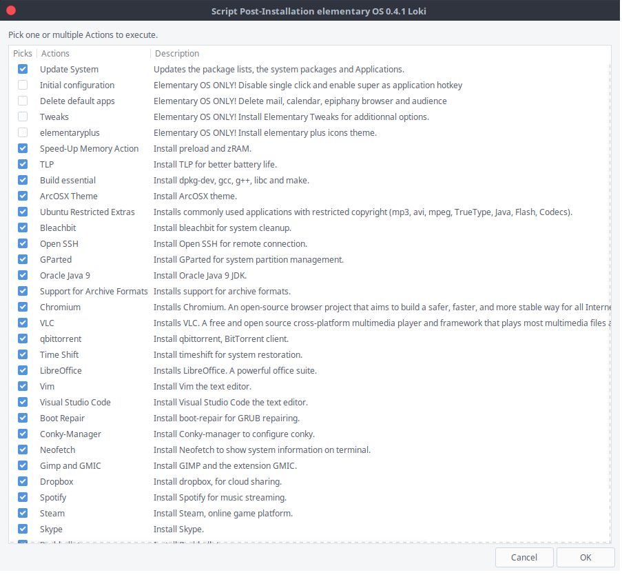

# Elementaryos_postinstall

This script provide a GUI to install third party softwares on Elementary OS Loki.
The script will automatically install Git and Gdebi unless they are already installed.



# Author

Marc-André Bourassa

# How to run
First, copy this line in a terminal :
```
sudo apt -y install software-properties-common python-software-properties software-properties-common -y

```
and this one to download and run the script :
```
wget -O /tmp/elementaryos_postinstall.sh https://raw.githubusercontent.com/bouhrassa/elementaryos_postinstall/master/elementaryos_postinstall.sh && chmod +x /tmp/elementaryos_postinstall.sh && /tmp/elementaryos_postinstall.sh

```
# Supported platforms
Tested on Elementary OS Loki 0.4.1. It should work on any Debian based system unless the opposite is mentioned in the description.

# source	
This script is inspired by :
https://github.com/Devil505/elementaryos-postinstall

# Status
There is currently no known bug.